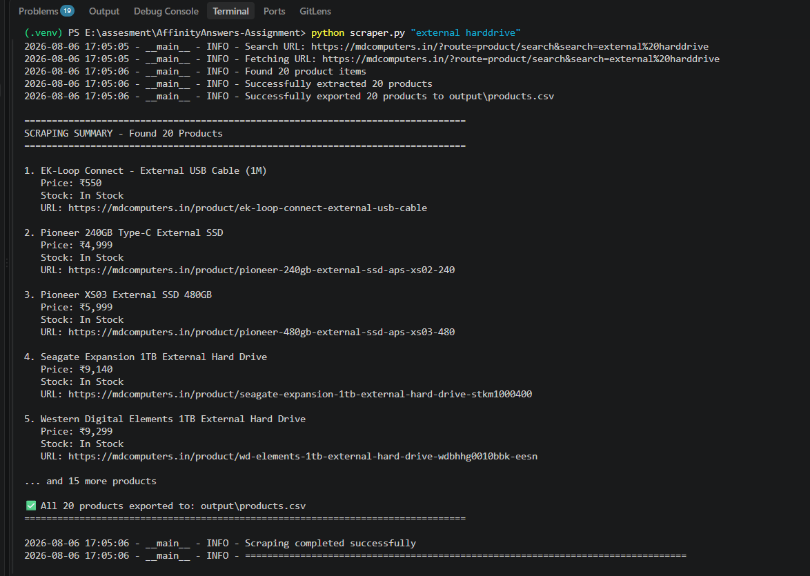

# MDComputers Product Scraper

A production-ready Python scraper that extracts products from MDComputers search results.

## Features

- Search products from command line
- Extract product name
- Extract price
- Extract availability
- Extract product URL
- Extract image URL
- Export to CSV
- Logging
- Retry mechanism

## Installation

pip install -r requirements.txt

## Usage

python scraper.py "external harddrive"

## Output

CSV file is generated inside:

output/products.csv

## Sample Execution

The screenshot below shows the scraper successfully extracting product information from MDComputers and exporting the results to CSV.

